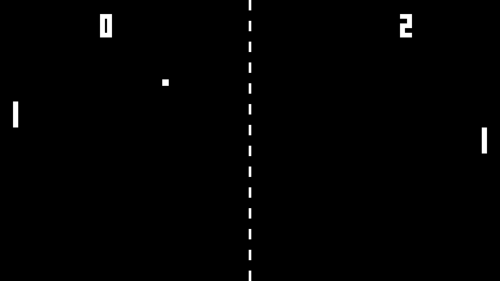

# This is Pong in C

#### Pretty basic Pong game written in C with SDL2 library.

## Dependencies

 - SDL2
 - SDL2_ttf. 

 See [installation](https://wiki.libsdl.org/SDL2/Installation)

## Building

`make` to build a project

`./main` to start the game
